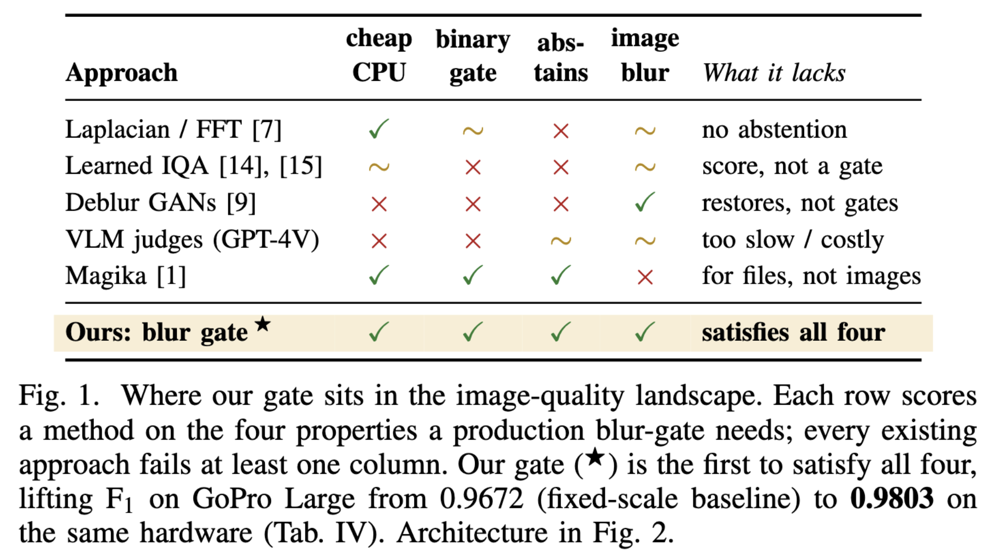
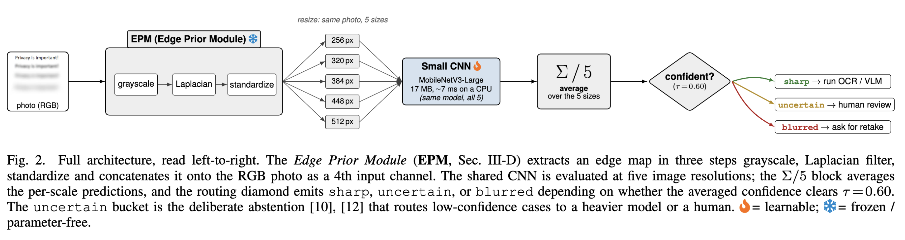

# MagikaDocument — Lightweight Blur Detector

A **Magika-inspired image quality gate** that classifies images as `sharp`, `blurred`, or `uncertain` in a few milliseconds on CPU. Built to sit at the front of vision pipelines so expensive downstream models (OCR, detection, classification, VLMs) never waste compute on unusable input.

**Result on GoPro Large test split:**

| Metric | Value |
|---|---|
| F1 | **0.9803** |
| Accuracy | 0.9806 |
| Precision | 0.9981 |
| Recall | 0.9631 |
| AUC | 0.9989 |
| Model size | 17 MB |
| Inference latency | ~17 ms / image (CPU, single-scale) |



*Fig. 1 — Where our gate sits in the image-quality landscape. Each row scores a method on the four properties a production blur-gate needs (cheap CPU, binary gate, abstains, image blur); every existing approach fails at least one column. Our gate is the first to satisfy all four, lifting F1 on GoPro Large from 0.9672 (fixed-scale baseline) to **0.9803** on the same hardware.*

---

## 1. The Business Problem

Most production vision pipelines — OCR, document understanding, KYC, face/object recognition, content moderation, retail search — silently degrade on blurry input. Concrete symptoms we see at client engagements:

1. **OCR on blurred receipts, invoices, or IDs** emits garbage text that downstream logic can't distinguish from legitimate data. Silent data-quality failures contaminate analytics.
2. **Product search from user photos** returns irrelevant results when the phone shot is motion-blurred, driving up refund / support cost.
3. **Large multimodal models** (GPT-4V-class) are expensive per call; burning those tokens on an unreadable frame is pure waste.
4. **Dataset curation at scale** — hand-filtering blurry images from millions of uploads is infeasible and stalls ML projects.
5. **Mobile / edge capture flows** need immediate "please retake" feedback; a cloud roundtrip for every shot is too slow.

What teams want is a **fast, cheap pre-check** that can:

- Run on **CPU** before the image is shipped to a GPU model or paid API.
- Return not just a label but a **calibrated confidence** so the pipeline can route uncertain cases to a human or a heavier model.
- Be **trainable without human annotation** — paired sharp/blur datasets already exist publicly, and domain data can be synthesized.

Existing alternatives fail on both ends: heavy restoration networks (deblur GANs, hundreds of millions of parameters) are too expensive to run per upload, while hand-crafted edge-variance heuristics (Laplacian variance, FFT-based) break on textured-but-sharp vs smooth-but-blurred scenes and can't be tuned per domain.

---

## 2. Our Solution

A two-class CNN classifier with a confidence-aware routing head, designed after the **Magika file-type detection** philosophy:

> *A small model, fast inference, CPU-friendly, constant-cost preprocessing, confidence-aware output — used as a routing or gating component, not as a final answer.*



*Fig. 2 — Full architecture, read left-to-right. The **Edge Prior Module (EPM)** extracts an edge map in three steps — grayscale → Laplacian filter → standardize — and concatenates it onto the RGB photo as a 4th input channel. The shared CNN is evaluated at five image resolutions (256, 320, 384, 448, 512); the Σ/5 block averages per-scale predictions, and the routing diamond emits `sharp`, `uncertain`, or `blurred` depending on whether the averaged confidence clears τ = 0.60. The `uncertain` bucket is the deliberate abstention that routes low-confidence cases to a heavier model or a human. 🔥 = learnable; ❄️ = frozen / parameter-free.*

### Recipe (F1 = 0.9803)

- **Data**: GoPro Large dataset. Both `blur/` and `blur_gamma/` folders count as positive (blurred); `sharp/` is negative. Paired sample generation — no extra human annotation required.
- **Backbone**: MobileNetV3-Large, ImageNet-pretrained, 2-class softmax head (~3.3M parameters).
- **Frequency-domain auxiliary channel (Freq-Aux)**: a per-image-standardized Laplacian magnitude map is concatenated to the RGB tensor as a **4th input channel**. The first conv is expanded from 3→4 channels (pretrained RGB weights preserved; the new slice is initialized from the mean of the RGB kernels). The Laplacian gives the network an explicit, scale-invariant edge-energy cue that classical blur heuristics rely on, freeing the convolutional layers to learn the harder texture vs structure distinction.
- **Training**: 384×384 input, AdamW lr=1e-4, CosineAnnealing, CrossEntropy, 25 epochs, medium augmentation (crop, flip, mild color jitter), mixed-precision.
- **Inference**: **5-scale multi-scale TTA** — run the model at 256, 320, 384, 448, 512 and average the softmax probabilities. Adds +0.57% F1 over single-scale, no retraining.
- **Routing**: return `sharp` or `blurred` when max softmax ≥ 0.60, otherwise return `uncertain` so the pipeline can hand off to a heavier model or a human.

### What we learned (engineering insights)

The final recipe is the output of a systematic evaluation across backbones, resolutions, losses, augmentation intensities, and ensembling strategies. Three findings that materially changed the design:

- **Resolution is by far the biggest lever.** Moving from 128 → 384 px alone adds +13% F1, far outweighing any architectural choice we tried.
- **Capacity × resolution interact non-linearly.** MobileNetV3-Large was neutral or slightly worse than MNV3-Small at 160-320 px, but clearly wins at ≥384 px. Model capacity only pays off once there is enough signal to learn from.
- **Extra paired data gives free points.** Including the GoPro `blur_gamma` folder (a second blur style of the same scenes) added +1% F1 with zero engineering cost.

Approaches we rejected after evaluation — worth noting for any team tempted to try them on a similar problem:

- **Focal loss** — hurts on a balanced dataset.
- **Strong/aggressive augmentation** — degrades precision at ≥224 px.
- **Training beyond 25 epochs at 384 px** — overfits, validation F1 regresses.
- **Threshold tuning on the validation set** — validation saturates to F1 = 1.0, so thresholds don't transfer.
- **Naive ensembles of top-N single models** — errors are highly correlated; the gain is negligible vs the compute cost.

---

## 3. Deployment Patterns

### 3.1 OCR / document pre-check

```python
from blur_detector.src.models.blur_detector import build_model
from blur_detector.src.datasets.freq_aux import FreqAuxModel
from blur_detector.src.inference.predictor import BlurPredictor
import torch

backbone = build_model("mobilenet_v3_large", pretrained=False, in_channels=4)
model = FreqAuxModel(backbone)
model.load_state_dict(torch.load("blur_detector_champion.pt"))

predictor = BlurPredictor(model, image_size=[256, 320, 384, 448, 512])

pred = predictor.predict("receipt.jpg")
if pred.label == "blurred":
    return {"status": "rejected", "reason": "image too blurry, please retake"}
elif pred.label == "uncertain":
    route_to_human_review(...)
else:
    return run_ocr(...)
```

Saves OCR compute on unusable inputs and gives end users an immediate "please retake the photo" signal — a UX win and a cost win in the same component.

### 3.2 Upload-time quality filter

Drop-in middleware in an image upload API. Reject or flag low-quality uploads before they hit storage or trigger downstream processing. The `uncertain` class lets product teams tune the precision / user-friction trade-off per channel (e.g. stricter on KYC, looser on social uploads).

### 3.3 Dataset curation for ML programs

Point the batch CLI at a directory of unlabeled images and it partitions them into `sharp/`, `blurred/`, `uncertain/` for downstream annotation or training. At ~7 ms per image on CPU, **a million images finish in under two hours on a single core** — a typical pre-step for any supervised vision program.

### 3.4 Cost routing in front of expensive models

```
image ─► BlurDetector ─┬─► sharp     ─► run full VLM / paid API (expensive)
                       ├─► blurred   ─► skip, return low-quality flag
                       └─► uncertain ─► small fallback model, or human
```

The blur detector is roughly **1,000× cheaper than a vision LLM**, so even rejecting 10% of traffic is a meaningful monthly saving. In engagements where VLM spend dominates, this single gate often pays for itself within days.

### 3.5 Edge / on-device inference

17 MB ONNX artifact with `dynamic_axes` enabled — deployable to mobile (CoreML / TFLite via ONNX converters), browser (ONNX Runtime Web), or embedded devices. Multi-scale TTA is opt-in; single-scale inference at 384 px still achieves F1 = 0.9722 if latency is the binding constraint.

---

## 4. Installation

Three ways to get running, ordered from fastest to most flexible. All paths assume Python ≥ 3.10 if you install natively.

### 4.1 Quick start with Docker (recommended for trying it out)

The image bundles PyTorch (CPU), ONNX Runtime, and the inference scripts. The model weights are pulled from Hugging Face at first run and cached in a mounted volume.

```bash
# Clone and build
git clone https://github.com/bradduy/MagikaDocumentFromPixel.git
cd MagikaDocumentFromPixel
docker build -t magika-document:latest .

# Run inference on a local image
docker run --rm \
  -v "$PWD/weights:/app/weights" \
  -v "$PWD/samples:/app/samples" \
  magika-document:latest \
  python blur_detector/scripts/predict.py \
    --checkpoint /app/weights/best.pt --freq_aux \
    /app/samples/your_image.jpg
```

GPU users can swap the base image for `pytorch/pytorch:2.1.0-cuda12.1-cudnn8-runtime` and add `--gpus all` to the run command.

### 4.2 Install from source (recommended for training / reproduction)

```bash
git clone https://github.com/bradduy/MagikaDocumentFromPixel.git
cd MagikaDocumentFromPixel

python -m venv venv
source venv/bin/activate          # Windows: venv\Scripts\activate

pip install -r blur_detector/requirements.txt
```

### 4.3 Install via pip (inference-only)

```bash
pip install torch torchvision onnxruntime pillow numpy pyyaml tqdm
git clone https://github.com/bradduy/MagikaDocumentFromPixel.git
cd MagikaDocumentFromPixel
```

### 4.4 Download pretrained weights

Champion checkpoint and ONNX artifact are hosted on Hugging Face: **[bradduy/MagikaDocumentFromPixel](https://huggingface.co/bradduy/MagikaDocumentFromPixel)**.

```bash
# Option A — huggingface_hub (Python)
pip install huggingface_hub
python -c "from huggingface_hub import snapshot_download; \
  snapshot_download('bradduy/MagikaDocumentFromPixel', local_dir='blur_detector/outputs/checkpoints/champion')"

# Option B — git lfs
git lfs install
git clone https://huggingface.co/bradduy/MagikaDocumentFromPixel blur_detector/outputs/checkpoints/champion

# Option C — direct download
mkdir -p blur_detector/outputs/checkpoints/champion
curl -L -o blur_detector/outputs/checkpoints/champion/best.pt \
  https://huggingface.co/bradduy/MagikaDocumentFromPixel/resolve/main/best.pt
curl -L -o blur_detector/outputs/checkpoints/champion/blur_detector.onnx \
  https://huggingface.co/bradduy/MagikaDocumentFromPixel/resolve/main/blur_detector.onnx
```

After this step, the `--checkpoint` paths shown in the next section work out of the box.

---

## 5. How to Use

### Run inference

```bash
python blur_detector/scripts/predict.py \
  --checkpoint blur_detector/outputs/checkpoints/champion/best.pt --freq_aux \
  path/to/image.jpg path/to/other.png
```

Output (one JSON line per image):

```json
{"file": "path/to/image.jpg", "label": "sharp",   "confidence": 0.97, "prob_sharp": 0.97, "prob_blurred": 0.03}
{"file": "path/to/other.png", "label": "blurred", "confidence": 1.00, "prob_sharp": 0.00, "prob_blurred": 1.00}
```

### Reproduce the champion

```bash
# Train (GPU recommended — 25 epochs @ 384px, ~4 min on an MI355X / ~2h on a single A100)
python blur_detector/scripts/train.py \
  --run_name freq_aux \
  --backbone mobilenet_v3_large --image_size 384 --batch_size 24 --lr 1e-4 \
  --loss ce --aug_level medium --epochs 25 --use_blur_gamma --freq_aux

# Evaluate on the official GoPro test split
python blur_detector/scripts/evaluate.py \
  --checkpoint blur_detector/outputs/checkpoints/freq_aux/best.pt --freq_aux
```

### Export to ONNX for deployment

```bash
python blur_detector/scripts/export_onnx.py \
  --checkpoint blur_detector/outputs/checkpoints/freq_aux/best.pt \
  --backbone mobilenet_v3_large --image_size 384 --freq_aux \
  --onnx_path blur_detector.onnx
```

---

## 6. Project Structure

```
MagikaDocument/
└── blur_detector/
    ├── configs/        — YAML hyperparameter config
    ├── data/           — GoPro dataset (gitignored, fetched separately)
    ├── outputs/        — Checkpoints + ONNX artifact (gitignored)
    ├── src/
    │   ├── datasets/   — GoProDataset (paired sharp/blur labeling)
    │   ├── models/     — MobileNetV3, TinyCNN, EfficientNet backbones
    │   ├── training/   — Trainer (AdamW, Cosine, AMP, early stop)
    │   ├── inference/  — BlurPredictor (multi-scale TTA + uncertain routing)
    │   └── utils/      — Metrics (F1, AUC, confusion matrix)
    └── scripts/        — prepare, train, evaluate, predict, export_onnx
```

---

## 7. Adapting to Your Domain

If your blur distribution differs from GoPro motion blur — e.g. defocus, low-light, compression artifacts, scanner skew — the recipe retrains cleanly with domain data:

1. **More blur types** — mix GoPro with REDS (video deblurring) or synthetic defocus generated from clean images. The two-class formulation does not change.
2. **Domain-specific sharp set** — for receipts, documents, or IDs, use a few thousand domain-sharp images as the positive class and generate synthetic motion/defocus blur with standard OpenCV kernels.
3. **Multi-class taxonomy** — swap the 2-class head for `{sharp, motion_blur, defocus_blur, noise, low_light}` when the downstream pipeline should react differently to different degradation types (e.g. retry on motion blur, reject on low-light).
4. **Calibration to your operating point** — confidence threshold (default 0.60) is a product-level knob. Sweep it on a small hand-labeled slice of production traffic to lock in the precision/recall trade-off you want.

---

## 8. Author

**Duy Tran Thanh (Brad Duy)** — Sr. Applied AI Engineer

Author and maintainer of this project. Available for applied-AI consulting engagements: production integrations, custom training on domain data, and tailored versions of the pipeline (edge deployment, multi-class taxonomy, bespoke routing logic).

- GitHub: [@bradduy](https://github.com/bradduy)
- Hugging Face: [@bradduy](https://huggingface.co/bradduy)

---

## 9. Citation

If you use this work in research or production, please cite:

> Duy, Tran Thanh (2026). *Edges Before Embeddings: A Confidence-Aware Blur Gate for Vision-Language Pipelines.* Zenodo. https://doi.org/10.5281/zenodo.19765336

BibTeX:

```bibtex
@misc{duy2026edges,
  author       = {Duy, Tran Thanh},
  title        = {Edges Before Embeddings: A Confidence-Aware Blur Gate for Vision-Language Pipelines},
  year         = {2026},
  publisher    = {Zenodo},
  doi          = {10.5281/zenodo.19765336},
  url          = {https://doi.org/10.5281/zenodo.19765336}
}
```

---

## 10. Licensing

Released under the **MIT License** — see [LICENSE](LICENSE). Copyright © 2026 Duy Tran Thanh (Brad Duy).
